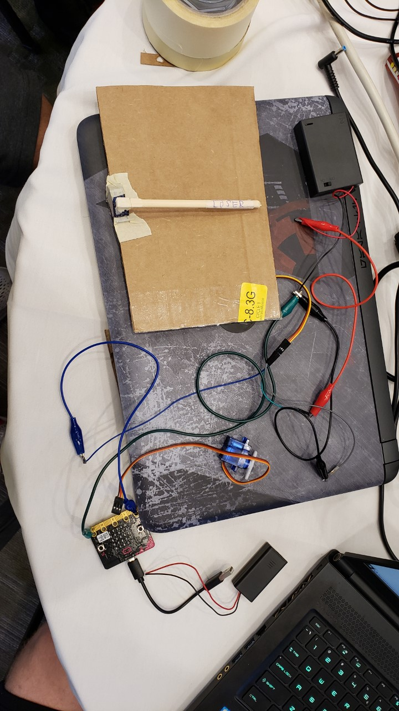
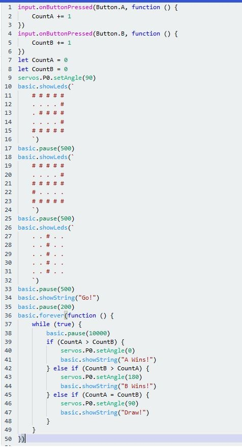

# SoarCS 2019!

<!-- Note, the line below this one is what links to your screenshot, **DO NOT REMOVE** -->

<!--
In this file, you should write a brief description of what your
project is, what you learned, and a simple screenshot of your work.

To add a screenshot, please replace `screenshot.png` with
your own screenshot.
-->

## <Arm Wrestling>

'Arm Wrestling' is a two player game in which participants compete to see who can press their button the most times.  The program keeps track of button clicks, and whoever has more at the end of the 10 second time period is the winner.
